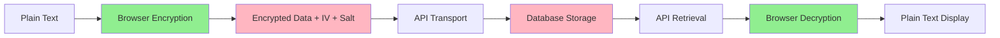

# Security Architecture

## Overview

Typelets implements a **zero-knowledge encryption architecture** where all note encryption and decryption happens exclusively in your browser. We cannot read your notes - even if we wanted to. This document details our security implementation for transparency and verification.

## Core Security Principles

### 1. Client-Side Encryption Only
- **All encryption/decryption occurs in the browser** using the Web Crypto API
- Notes are encrypted **before** leaving your device
- The server never receives unencrypted data
- Even database administrators cannot read your notes

### 2. Zero-Knowledge Architecture
- We store only encrypted data
- Encryption keys are derived from user-specific secrets
- No master keys exist that could decrypt all user data
- Password reset means permanent data loss (by design)

## Technical Implementation

### Encryption Algorithm

```
Algorithm: AES-256-GCM
Key Derivation: PBKDF2-SHA256
Iterations: 250,000
Key Length: 256 bits
IV Length: 96 bits (12 bytes)
Salt Length: 128 bits (16 bytes)
```

### Key Management

#### Mandatory Master Password
On first login, users **must** set up a master password:

1. **Master Password Setup (Required)**
   - User creates a strong password on first use
   - Required at the start of every session
   - Portable across all devices with same password
   - Zero-knowledge: we cannot recover forgotten passwords
   - Encrypts all notes with user-specific derivation

2. **Master Password Encryption Flow**
   ```
   Input: masterPassword
   ↓
   User-specific salt: "typelets-salt-{userId}-v1"
   ↓
   PBKDF2 (250,000 iterations)
   ↓
   AES-256-GCM Key (session only)
   ↓
   Per-note encryption with unique salts
   ```

#### Security Enforcement
- **Mandatory setup**: Cannot access app without setting master password
- **Session protection**: Master password required each session
- **No backdoors**: Lost passwords = permanently lost data
- **Test verification**: Encryption verified before committing
- **Memory cleanup**: Keys cleared on logout/session end

### Per-Note Encryption

Each note has unique encryption parameters:

```javascript
{
  encryptedTitle: "base64...",   // AES-256-GCM encrypted
  encryptedContent: "base64...", // AES-256-GCM encrypted
  iv: "base64...",                // Unique 96-bit IV
  salt: "base64..."               // Unique 128-bit salt
}
```

**Why per-note salts?**
- Prevents rainbow table attacks
- Ensures identical content produces different ciphertext
- Limits damage if a single key is compromised
- Makes cryptanalysis significantly harder

### Data Flow



## Security Features

### Memory Management
- **Decryption cache with TTL**: 15-minute expiry
- **Automatic cache cleanup**: Every 5 minutes
- **Size-limited cache**: Prevents memory exhaustion
- **User-scoped cleanup**: On logout/switch

### Browser Requirements
- **HTTPS required**: Web Crypto API only works over secure connections
- **Modern browser needed**: Chrome 37+, Firefox 34+, Safari 11+
- **No plugins required**: Native browser APIs only

### Authentication
- **Clerk Authentication**: Industry-standard OAuth/JWT
- **Token-based API access**: No passwords stored
- **Automatic token refresh**: Seamless security updates

## Attack Mitigation

### What We Protect Against

| Attack Vector | Protection Method |
|--------------|------------------|
| Server breach | Encrypted data only - no readable content |
| Man-in-the-middle | HTTPS + encrypted payload |
| Rainbow tables | Per-note salts (128-bit) |
| Brute force | 250,000 PBKDF2 iterations |
| Key reuse | Unique IV per encryption |
| Memory dumps | Cache TTL + cleanup |
| XSS attacks | CSP headers + input sanitization |
| SQL injection | Parameterized queries + ORM |

### Limitations

**We cannot protect against:**
- Compromised user device (keyloggers, malware)
- Physical access to unlocked browser
- Weak master passwords (if used)
- Browser vulnerabilities
- Users who lose their encryption keys

## User Experience & Security Flow

### First-Time Setup
1. **Account Creation**: Sign up via Clerk authentication
2. **Master Password Setup** (Required):
   - Create a strong master password
   - This becomes your encryption key
   - Cannot be recovered if forgotten
3. **Confirmation**: Encryption tested and verified
4. **Start Using**: Create your first encrypted note

### Daily Usage
```
Login → Enter Master Password → Access Notes → Auto-lock on Session End
```

### Security States
- **🔐 Locked**: Master password required to access notes
- **🔓 Unlocked**: Active session with decryption key in memory
- **⏰ Session End**: Keys cleared, re-authentication required
- **🚪 Logout**: All encryption keys purged from memory

### Test the Encryption
1. Open browser DevTools → Network tab
2. Create/edit a note
3. Inspect the API request payload
4. Verify `title` and `content` show as `[ENCRYPTED]`
5. Verify presence of `encryptedTitle`, `encryptedContent`, `iv`, `salt`

### Verify Zero-Knowledge
```sql
-- Even with database access, you see only:
SELECT title, content FROM notes;
-- Returns: [ENCRYPTED], [ENCRYPTED]

SELECT encryptedTitle FROM notes;
-- Returns: Base64 encrypted data (unreadable)
```

## Best Practices for Users

### Maximum Security
1. **Use a strong master password**: 16+ characters with mixed types
2. **Never share your password**: Even we cannot recover it
3. **Regular backups**: Export important notes periodically
4. **Use HTTPS only**: Never access via HTTP
5. **Unique password**: Don't reuse from other services

### Understanding Your Encryption
- **Master Password**: Required every session for security
- **Zero-Knowledge**: We never see your password or unencrypted data
- **No recovery options**: Lost password = lost data (by design)
- **Export regularly**: Your data, your responsibility

## Compliance & Standards

### Cryptographic Standards
- **NIST Approved**: AES-256-GCM (FIPS 197)
- **OWASP Compliant**: Following encryption best practices
- **PBKDF2 iterations**: Exceeds OWASP 2023 recommendation (210,000)

### Browser Standards
- **Web Crypto API**: W3C standard implementation
- **SubtleCrypto**: Hardware acceleration when available
- **Secure Context**: HTTPS-only operation

## Frequently Asked Questions

### Q: Can Typelets employees read my notes?
**No.** Notes are encrypted in your browser before transmission. We only store encrypted data that we cannot decrypt.

### Q: What happens if I forget my master password?
**Your data becomes permanently inaccessible.** This is intentional - true security means even we cannot recover your data.

### Q: Why not use end-to-end encryption like Signal?
**We do!** The "ends" are your browser sessions. Each note is encrypted client-side (one end) and decrypted client-side (other end).

### Q: Is my data safe if Typelets is hacked?
**Yes.** Attackers would only obtain encrypted data without the means to decrypt it. Your keys never leave your browser.

### Q: Can I verify the encryption myself?
**Absolutely!** Our code is open source. Use browser DevTools to inspect network requests and see the encrypted payloads.

### Q: Why 250,000 PBKDF2 iterations?
**Security vs Performance balance.** This provides ~0.5 seconds of computation on modern devices while exceeding OWASP recommendations.

### Q: What about quantum computers?
**AES-256 is quantum-resistant** with effective 128-bit security against Grover's algorithm. We'll migrate to post-quantum algorithms when standardized.

## Security Disclosure

Found a vulnerability? Please report it responsibly:

**Email**: typelets@typelets.com  
**PGP Key**: [Available on request]  
**Response Time**: Within 48 hours

We appreciate security researchers and will acknowledge your contribution (with permission).

## Technical Support

For security-related questions:
- **Documentation**: https://typelets.com/security
- **GitHub Issues**: https://github.com/typelets/typelets-app/issues
- **Email**: typelets@typelets.com

---

**Remember**: True security means even we cannot access your data. Your privacy is not a feature - it's our foundation.